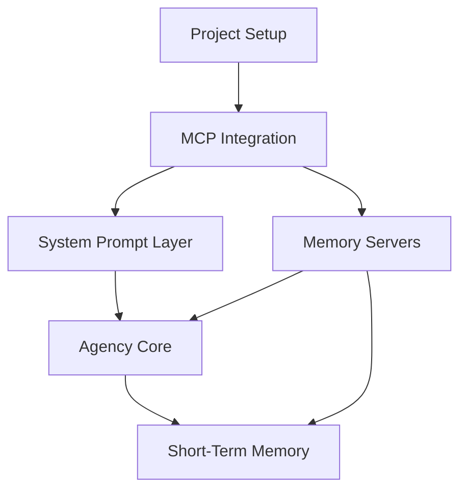

# AI Coaching System Task List

## Project Setup
- [x] Initialize project repository
  - [x] Set up Python project structure
  - [x] Configure basic project tools (pyproject.toml)
  - [ ] Set up testing framework
  - [ ] Configure linting and formatting
  - [ ] Set up CI pipeline basics
- [x] Set up documentation
  - [x] Create architecture documentation
  - [ ] Set up API documentation generation
  - [ ] Create development guidelines

## Core MCP Integration
- [x] Set up MCP client framework
  - [x] Implement base MCP client class
  - [x] Add connection management
  - [x] Implement error handling
  - [x] Add logging system
- [ ] Create tool interfaces
  - [ ] Define base tool interface
  - [ ] Implement tool registration system
  - [ ] Create tool validation system
- [ ] Implement resource handling
  - [ ] Create resource manager
  - [ ] Implement resource caching
  - [ ] Add resource validation

## System Prompt Layer
- [ ] Create prompt management system
  - [ ] Define prompt template structure
  - [ ] Implement prompt composition system
  - [ ] Add context injection mechanism
- [ ] Build coaching traits system
  - [ ] Define trait schema
  - [ ] Implement trait composition
  - [ ] Create trait validation
- [ ] Implement guidelines system
  - [ ] Define guideline structure
  - [ ] Create guideline processor
  - [ ] Implement guideline validation

## Agency Core
- [ ] Build conversation manager
  - [ ] Create conversation state handling
  - [ ] Implement message processing
  - [ ] Add context management
- [ ] Implement planner
  - [ ] Create planning algorithm
  - [ ] Implement goal management
  - [ ] Add action sequencing
- [ ] Build action executor
  - [ ] Create execution pipeline
  - [ ] Implement error handling
  - [ ] Add result processing

## Memory Servers (MCP)
- [x] Knowledge Graph Server
  - [x] Set up basic graph database (using memory server)
  - [x] Implement MCP server wrapper (configured in config.json)
  - [x] Create CRUD operations (create_entities, read_graph, delete_entities)
  - [x] Add query capabilities (search_nodes, open_nodes)
  - [x] Implement relationship management (create_relations, delete_relations)
- [ ] Vector Store Server
  - [ ] Set up vector database
  - [ ] Implement MCP server wrapper
  - [ ] Create embedding management
  - [ ] Add similarity search
  - [ ] Implement batch operations
- [ ] Conversation State Server
  - [ ] Design state schema
  - [ ] Implement MCP server wrapper
  - [ ] Create state management
  - [ ] Add history tracking
- [ ] Profile Tracker Server
  - [ ] Design profile schema
  - [ ] Implement MCP server wrapper
  - [ ] Create profile management
  - [ ] Add tracking capabilities
- [ ] Action History Server
  - [ ] Design history schema
  - [ ] Implement MCP server wrapper
  - [ ] Create history management
  - [ ] Add analysis capabilities

## Testing Framework
- [ ] Unit testing setup
  - [ ] Set up test infrastructure
  - [ ] Create mock MCP clients
  - [ ] Build test utilities
- [ ] Integration testing
  - [ ] Set up integration test framework
  - [ ] Create test servers
  - [ ] Build end-to-end tests
- [ ] Performance testing
  - [ ] Create performance benchmarks
  - [ ] Implement load tests
  - [ ] Add monitoring tools

## Short-Term Memory System (Final Phase)
- [ ] Markdown Buffer
  - [ ] Design markdown structure
  - [ ] Implement file management
  - [ ] Create update system
- [ ] Change History
  - [ ] Design history tracking
  - [ ] Implement change logging
  - [ ] Add analysis tools
- [ ] Memory Consolidator
  - [ ] Create consolidation timer
  - [ ] Implement analysis system
  - [ ] Build pruning algorithm
  - [ ] Add distribution system

## Development Priorities

### Phase 1: Foundation
1. Project Setup
2. Core MCP Integration
3. Basic Memory Servers

### Phase 2: Core Systems
1. System Prompt Layer
2. Basic Agency Core
3. Testing Framework

### Phase 3: Memory Enhancement
1. Advanced Memory Servers
2. Advanced Agency Features
3. Performance Optimization

### Phase 4: Short-Term Memory
1. Markdown Buffer
2. Consolidation System
3. Integration Testing

## Dependency Graph

## Notes

### Implementation Guidelines
- Follow TDD approach for all components
- Document all APIs using TypeDoc
- Create integration tests for each MCP server
- Use semantic versioning
- Keep dependencies minimal

### Performance Targets
- Memory server response time < 100ms
- Consolidation processing < 1s
- Short-term memory updates < 10ms
- System prompt composition < 50ms

### Security Considerations
- Implement rate limiting for all servers
- Add input validation for all external data
- Secure all file operations
- Validate all MCP messages

### Documentation Requirements
- Architecture diagrams for each component
- API documentation for all public interfaces
- Performance benchmarks
- Security guidelines
- Deployment instructions
