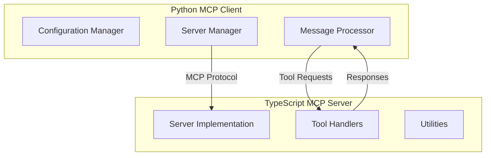

# Codebase Summary

This project consists of two main components that work together through the Model Context Protocol (MCP):

## 1. Python MCP Client (`mcp_client/`)

A robust Python implementation of the MCP client that connects to and manages multiple MCP servers. This client serves as the foundation for AI model interactions through the MCP protocol.

### Core Components

#### Configuration (`config/`)
- **Config Manager** (`config_manager.py`)
  - MCP server configuration management
  - Environment variable handling
  - Server settings coordination

#### Server Management (`server/`)
- **Server Manager** (`server_manager.py`)
  - MCP server lifecycle management
  - Multi-server connection handling
  - Protocol-compliant communication
  - Error recovery and health monitoring
  - Windows-specific optimizations:
    * Winsock initialization
    * DNS resolution
    * Network stack management
  - Process management:
    * Health checks
    * Resource monitoring
    * Graceful cleanup

#### Processing (`processing/`)
- **Message Processor** (`message_processor.py`)
  - MCP protocol message formatting
  - Server routing logic
  - Processing pipeline management

- **Query Processor** (`query_processor.py`)
  - MCP tool and resource coordination
  - Response processing
  - Cross-server query handling

#### Utilities (`utils/`)
- **Logging Config** (`logging_config.py`)
  - System-wide logging configuration
  - MCP communication logging

### Client Features
- Concurrent connections to multiple MCP servers
- Protocol-compliant message handling
- Robust error recovery
- Efficient resource management
- Cross-server tool orchestration

## 2. TypeScript MCP Server (Obsidian Integration)

A specialized MCP server implementation that provides Obsidian vault integration capabilities through the MCP protocol.

### Server Components

#### Core Server (`src/`)
- **Server Implementation** (`server.ts`)
  - MCP protocol endpoint
  - Message handling
  - Tool/resource registration
  - Connection management

- **Tool Definitions** (`tool-definitions.ts`)
  - MCP tool specifications
  - Input/output schemas
  - Tool documentation

#### Handlers (`src/handlers/`)
- **Note Operations** (`note-handlers.ts`)
  - Note CRUD operations
  - Metadata management
  - Template processing

- **Search Functionality** (`search-handlers.ts`)
  - Content search
  - Pattern matching
  - Query optimization

- **Tag Management** (`tag-handlers.ts`)
  - Tag operations
  - Relationship tracking
  - Hierarchy management

#### Utilities (`src/utils/`)
- **Note Utilities** (`note-utils.ts`)
  - Note processing helpers
  - Content manipulation
  - Metadata handling

### Server Features
- Full Obsidian vault integration
- Rich note manipulation tools
- Advanced search capabilities
- Metadata and relationship management
- Template system support

## MCP Protocol Integration

The two components communicate through the Model Context Protocol:

### Protocol Features
- Standardized tool definitions
- Resource management
- Error handling
- Security controls
- Connection lifecycle management

## Data Flow

1. Client Initialization
   - Configuration loading
   - Server discovery
   - Connection establishment

2. Server Registration
   - Tool/resource registration
   - Capability announcement
   - Protocol handshake

3. Operation Flow
   - Client tool request
   - Protocol message formatting
   - Server processing
   - Response handling

## External Dependencies

### MCP Client Dependencies
- Python 3.8+
- Protocol handling libraries
- Networking utilities

### MCP Server Dependencies
- Node.js
- TypeScript
- MCP SDK
- Obsidian API

## Recent Changes

- [x] Enhanced MCP protocol compliance
- [x] Improved server connection management
- [x] Added tool definition schemas
- [x] Enhanced error handling
- [x] Optimized message processing

## Next Steps

1. Protocol Enhancements
   - Extended tool capabilities
   - Resource optimization
   - Connection pooling

2. Client Improvements
   - Enhanced error recovery
   - Better server monitoring
   - Tool usage analytics

3. Server Development
   - Additional Obsidian features
   - Performance optimization
   - Extended search capabilities

## Documentation Structure

All project documentation is maintained in `cline_docs/`:
- `mpc_architecture.md`: MCP protocol details
- `projectRoadmap.md`: Development roadmap
- `techStack.md`: Technology choices
- `currentTask.md`: Active development
- Additional specialized documentation

*Note: This document is regularly updated to reflect the evolving architecture and implementation details of both the MCP client and server components.*
