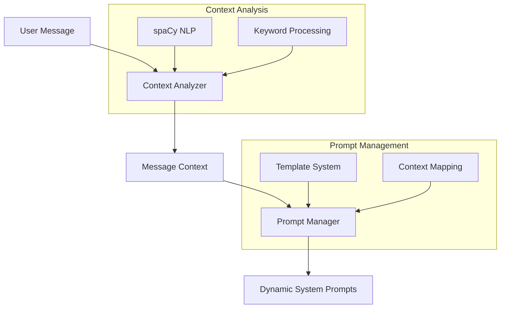

# Dynamic System Prompts and NLP

This document details the implementation of dynamic system prompts and natural language processing (NLP) in the MCP client.

## Architecture Overview

The system consists of two main components:
1. Context Analysis (NLP)
2. Dynamic Prompt Management



## 1. Context Analysis System

### Implementation (`mcp_chat/nlp/context_analyzer.py`)

The context analyzer uses spaCy and flashtext for efficient natural language processing:

#### Key Components
- **spaCy Model**: Uses 'en_core_web_sm' for core NLP tasks
- **KeywordProcessor**: Efficient keyword matching using flashtext

#### Analysis Features
1. **Message Type Detection**
   - Categories: reflection, insight, planning, implementation, task
   - Pattern-based classification using predefined keywords
   - Default fallback to 'task' type

2. **Complexity Estimation**
   - Metrics:
     - Average tokens per sentence
     - Named entity count
     - Part-of-speech diversity
   - Levels: low, medium, high

3. **Phase Detection**
   - Phases: start, middle, end
   - Based on temporal markers in text
   - Default to 'start' if unclear

4. **Tool Detection**
   - Predefined tool categories with associated keywords
   - Categories: obsidian, browser, weather, file, database, api

5. **Sensitive Data Detection**
   - Keywords: private, secret, sensitive, personal, confidential
   - Boolean flag in context output

### Context Output Format
```json
{
    "message_type": "string",
    "interaction_phase": "string",
    "complexity": "string",
    "tools_needed": ["string"],
    "entities": [
        {
            "text": "string",
            "label": "string"
        }
    ],
    "sentiment": "float",
    "sensitive_data": "boolean"
}
```

## 2. Prompt Management System

### Implementation (`mcp_chat/prompts/prompt_manager.py`)

The prompt manager handles template storage, dynamic prompt generation, context-based prompt selection, and maintains a dynamic scratch pad for persistent context.

#### Scratch Pad System
The scratch pad provides a dynamic context layer that persists across conversations through a dedicated MCP server:

```python
# Add new context
scratch_pad.append_content("User prefers structured weekly planning")

# Update entire context
scratch_pad.update_content("Complete user profile and preferences...")

# Clear context if needed
scratch_pad.clear_content()
```

Content is automatically:
- Timestamped and validated
- Persisted through the MCP scratchpad server
- Loaded dynamically into system prompts
- Managed with atomic file operations

The scratchpad server provides:
- Persistent storage
- Content validation
- Error recovery
- Atomic operations
- MCP protocol compliance

Integration points:
1. Session Initialization
   - Core personality prompt loaded first
   - Dynamic prompts including scratchpad loaded asynchronously
   - Content merged into system prompts

2. Session Management
   - New sessions start with fresh prompt loading
   - Loaded sessions reload dynamic prompts
   - Scratchpad content automatically included

3. Command Handling
   - /new command reinitializes prompts
   - /load command reloads dynamic content
   - Content updates trigger prompt refresh

#### Core Components

1. **PromptTemplate Class**
   ```python
   @dataclass
   class PromptTemplate:
       name: str
       content: str
       description: str
       variables: List[str]
       tags: List[str]
       cache_control: bool = False
   ```

2. **SystemPromptManager Class**
   - Manages prompt templates
   - Handles template storage and retrieval
   - Generates context-specific prompts

#### Default Templates

1. **Coach Personality**
   - Core personality traits and approach
   - Always included in prompt set
   - Cache control enabled for consistency

2. **Session Structure**
   - Interaction framework
   - Added at session start
   - Guides conversation flow

3. **Memory Management**
   - Note-taking guidelines
   - Added for reflection/insight messages
   - Ensures continuity

4. **Privacy**
   - Data handling guidelines
   - Added when sensitive data detected
   - Ensures security compliance

### Prompt Selection Logic

The system selects prompts based on message context:

1. **Base Selection**
   - Always includes core personality prompt
   - Includes current scratch pad content if available
   - Adds context-specific prompts based on:
     - Message type
     - Interaction phase
     - Data sensitivity

2. **Context Mapping**
   ```python
   if message_type in ['reflection', 'insight']:
       # Add memory management
   if phase == 'start':
       # Add session structure
   if sensitive_data:
       # Add privacy prompt
   ```

## File Storage

Prompts are stored in JSON format at `chat_history/prompts/templates.json`:
```json
[
    {
        "name": "string",
        "content": "string",
        "description": "string",
        "variables": ["string"],
        "tags": ["string"]
    }
]
```

## Usage Example

```python
# Initialize systems
context_analyzer = ContextAnalyzer()
prompt_manager = SystemPromptManager()

# Process user message
message = "Let's reflect on yesterday's progress"
context = context_analyzer.analyze_message_context(message)

# Generate prompts
prompts = prompt_manager.get_prompts_by_context(context)
```

## Best Practices

1. **Context Analysis**
   - Keep keyword lists updated
   - Monitor classification accuracy
   - Adjust complexity metrics as needed

2. **Prompt Management**
   - Maintain template consistency
   - Update variables regularly
   - Monitor prompt effectiveness

3. **Scratch Pad Usage**
   - Add key insights and patterns
   - Update user preferences and traits
   - Maintain relevant conversation history
   - Clear outdated or irrelevant information

3. **System Integration**
   - Regular NLP model updates
   - Cache sensitive prompts
   - Log prompt selection patterns

## Future Considerations

1. **Enhanced Analysis**
   - Sentiment analysis improvements
   - Advanced pattern recognition
   - Multi-language support

2. **Prompt Evolution**
   - Dynamic template generation
   - Context-based variable injection
   - Performance optimization

3. **Integration Depth**
   - Enhanced memory integration
   - Cross-session context
   - Adaptive prompt refinement

4. **Scratch Pad Evolution**
   - Automatic context summarization
   - Priority-based content management
   - Context age-out policies
   - Integration with knowledge graph

*Note: This documentation is updated as the system evolves and new capabilities are added.*
