# MCP Architecture

## Overview
MCP (Model Context Protocol) is an open protocol that standardizes how applications provide context to LLMs. It functions as a universal connector (similar to USB-C) for AI applications, enabling standardized connections between AI models and various data sources and tools.

```mermaid
graph TD
    subgraph Computer["Your Computer"]
        Client["Host with MCP Client<br/>(Claude, IDEs, Tools)"]
        ServerA["MCP Server A"]
        ServerB["MCP Server B"]
        ServerC["MCP Server C"]
        DataA["Local Data Source A"]
        DataB["Local Data Source B"]
        
        Client -->|MCP Protocol| ServerA
        Client -->|MCP Protocol| ServerB
        Client -->|MCP Protocol| ServerC
        
        ServerA --> DataA
        ServerB --> DataB
    end
    
    RemoteC["Remote Service C"]
    ServerC -->|Web APIs| RemoteC
    
    style Computer fill:#404040,stroke:#666
    style RemoteC fill:#404040,stroke:#666
    style Client fill:#333,stroke:#666
    style ServerA fill:#333,stroke:#666
    style ServerB fill:#333,stroke:#666
    style ServerC fill:#333,stroke:#666
    style DataA fill:#333,stroke:#666,rx:30,ry:30
    style DataB fill:#333,stroke:#666,rx:30,ry:30
    style RemoteC fill:#333,stroke:#666,rx:30,ry:30
```

## Core Components

### MCP Host
- Applications that need to access data through MCP
- Examples: Claude Desktop, IDEs, AI tools
- Connects to multiple MCP servers simultaneously
- Consumer of the MCP protocol

### MCP Client
- Protocol implementation layer
- Maintains 1:1 connections with servers
- Handles communication and connection management
- Implements the MCP protocol specification

### MCP Server
- Lightweight service programs
- Exposes specific capabilities through standardized protocol
- Can connect to both local and remote data sources
- Acts as protocol endpoint

### Data Sources

#### Local Data Sources
- Files on local filesystem
- Local databases
- System services
- Secured within infrastructure
- Direct access through MCP servers

#### Remote Services
- External APIs and web services
- Cloud-based resources
- Third-party integrations
- Accessed via Web APIs through MCP servers

## Protocol Features
- Standardized data access methods
- Vendor-agnostic LLM integration
- Security-first design
- Extensible architecture
- Built-in best practices for data handling

## Security Considerations
- Local data remains within infrastructure
- Controlled access to remote services
- Standardized security protocols
- Connection isolation between servers